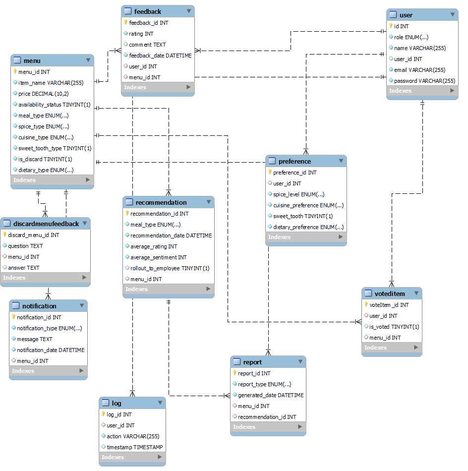
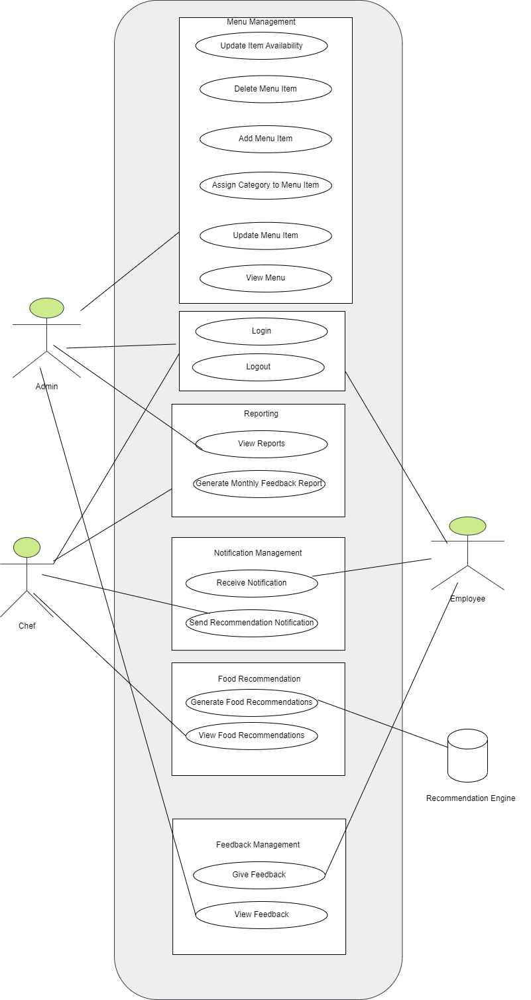

# cafeteria-management-system

Learn and Code Final Assignment - Recommendation Engine - Cafeteria Management System

## Project Overview

This project is a recommendation engine designed for a cafeteria to enhance food choices for customers through personalized recommendations, ratings, and feedback. The goal is to improve customer satisfaction by addressing the absence of personalized food recommendations and feedback mechanisms.

## Roles

1. **Admin**
2. **Chef**
3. **Users (Employees)**

## Features

### User Authentication & Authorization

1. **Menu Management (Admin)**

2. **Food Recommendation (Chef)**

3. **Employee Feedback**

4. **Monthly Feedback Reporting**

5. **Notifications**

## Console Application

## Technical Requirements

### Database - **MySQL**

### Recommendation Algorithm

### Socket Programming

## Technologies Used

- **Languages**: TypeScript
- **Database**: MySQL
- **Socket Programming**: For real-time notifications

## UML Diagrams :

### ER Diagram

### Class Diagram

### Use Case Diagram

